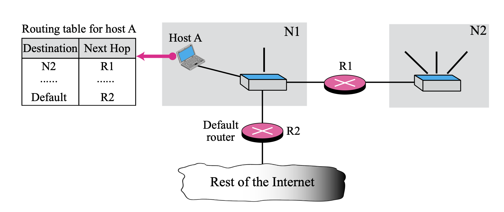
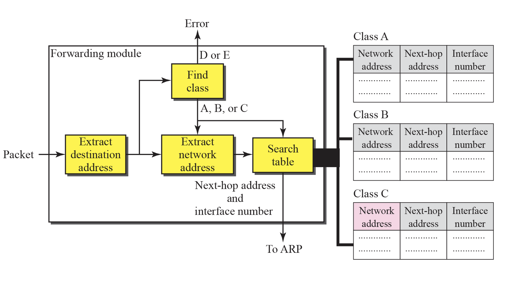
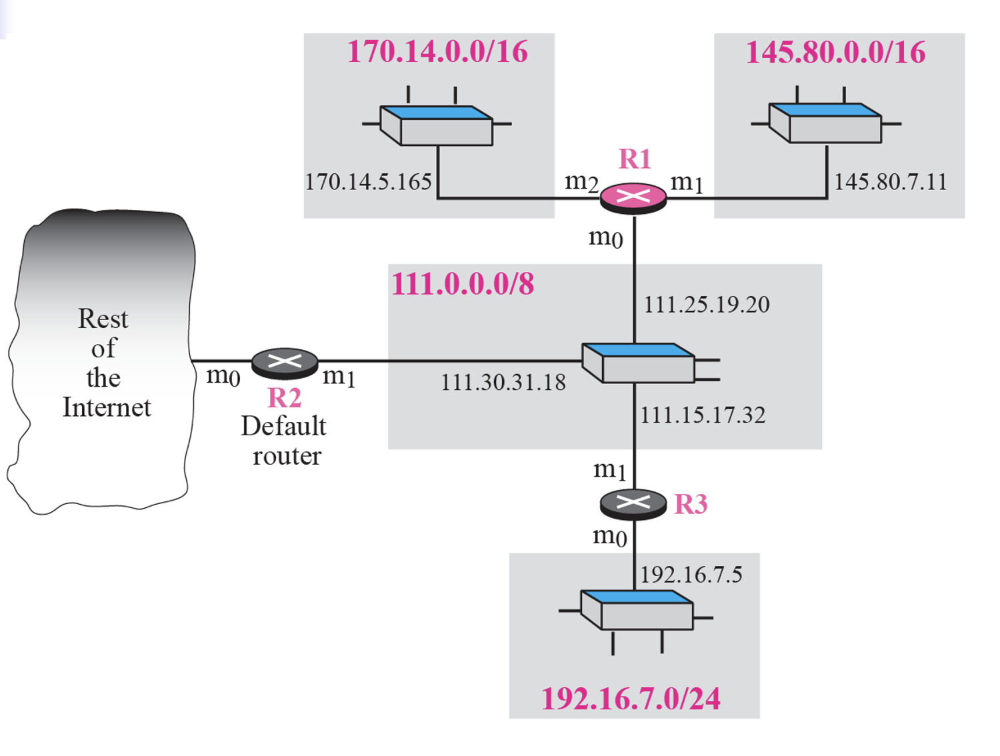
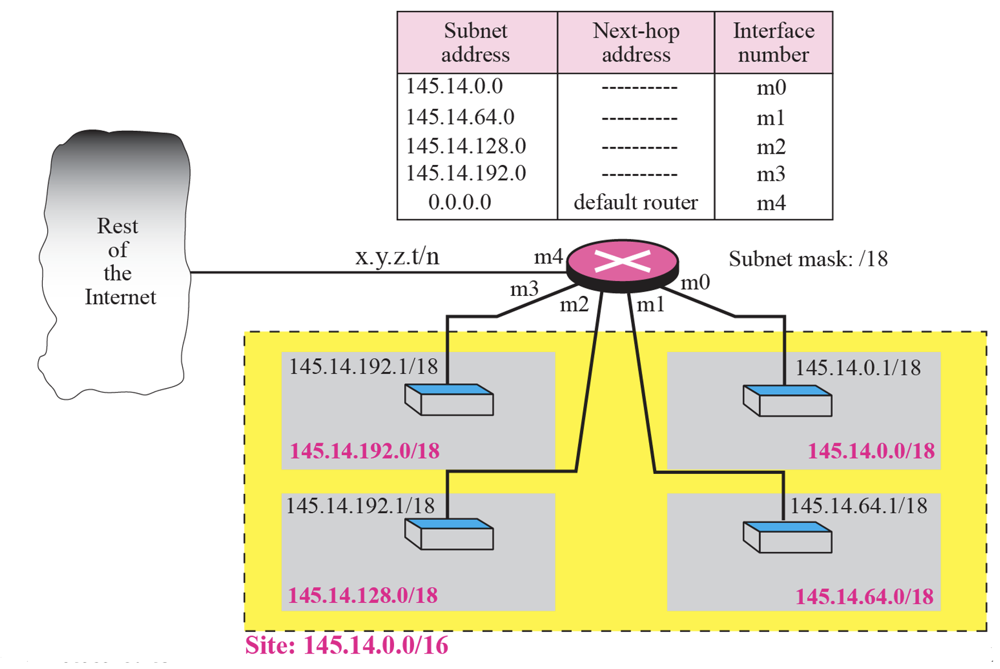
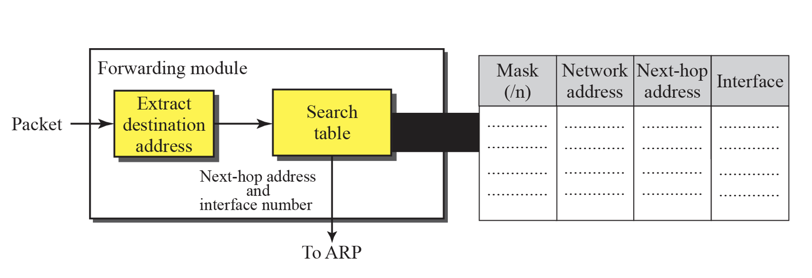
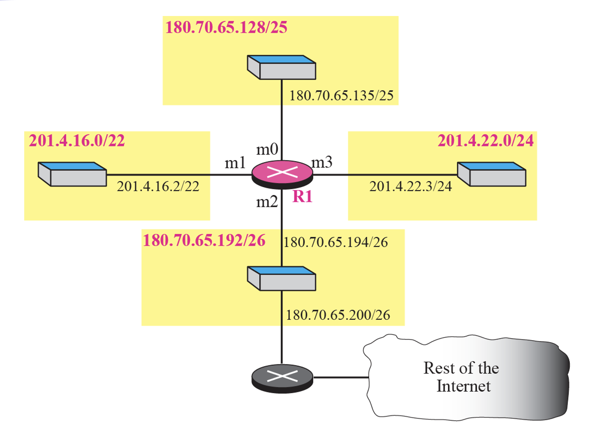
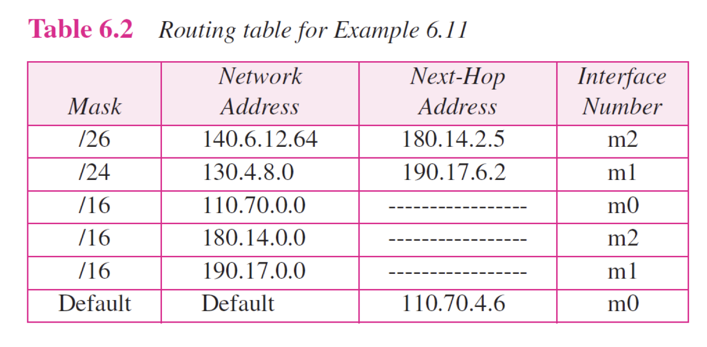
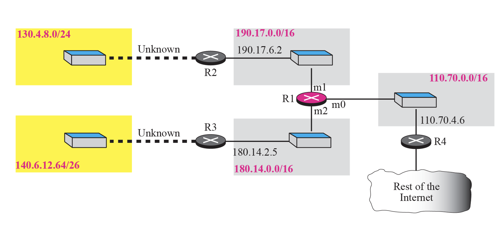
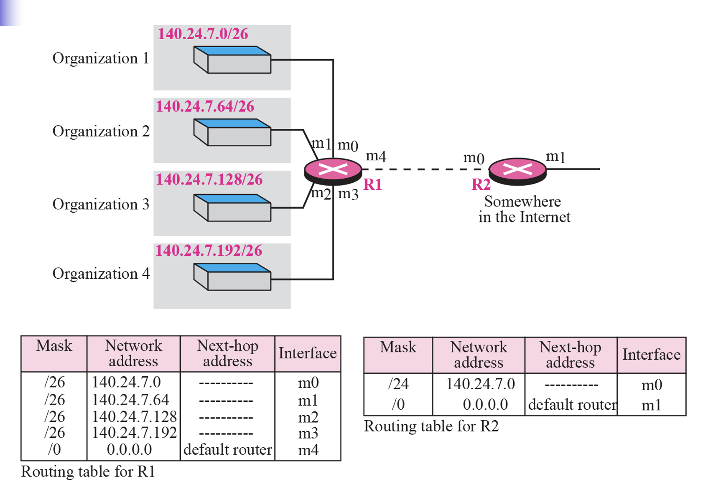
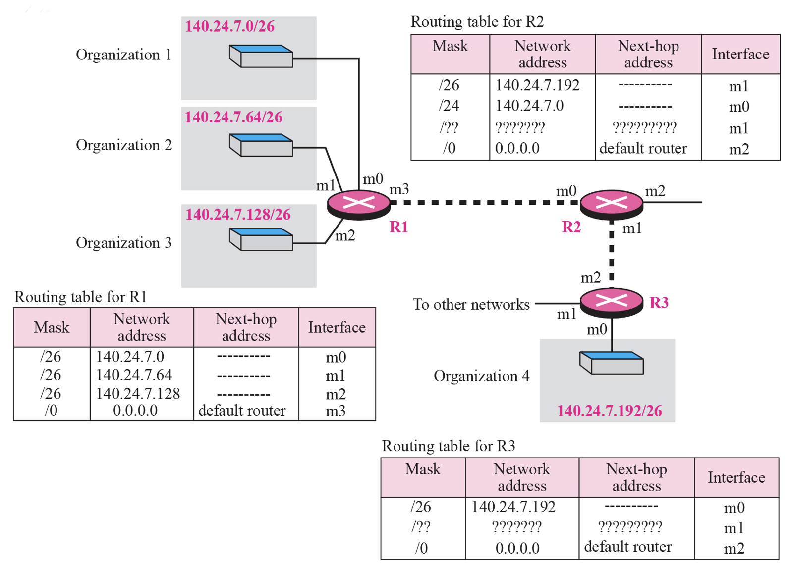

# TCP/IP
chap 06

## Delivery
- Direct Delivery: 송신자와 수신자가 같은 네트워크 안에 있을 때 직접 전달
- Indirect Delivery: 송신자와 수신자가 다른 네트워크에 있을 때 라우터를 거쳐 전달
 

## Forwarding
- 포워딩이란?  
    + 도착한 패킷을 목적지로 가는 경로상(next hop)으로 보내는 일을 말한다.   

- 포워딩 방식
    - 목적지 주소 기반(Forwarding based on destination address)
    - 라벨 기반 포워딩(Forwarding based on label)
    

### 목적지 주소 기반 포워딩
- next-hop method  
    + 목적지 호스트가 다른 네트워크에 있을 때, 라우터가 최종 목적지까지 직접 가지 않고,  
    중간 경로의 다음 라우터(next hop router)에게 패킷을 넘기는 방식  

    
     
    
      

- Network-specific method
    + 호스트가 아닌 네트워크 전체를 대상으로 하는 방법 
    + 테이블 크기 절감, 빠른 포워딩 등의 장점 

    
      

- Host-specific
    + 하나의 호스트에만 적용되는 구체적인 경로 (긴 prefix) 
    + 특정 서버만 우회/고정 경로로 보낼 때, 디버그 정책 용도 등으로 사용 

    
      

- Default routing
    + 라우팅 테이블에서 어떤 엔트리에도 매칭되지 않는 경우 마지막으로 선택되는 경로
    + prefix의 길이가 0이므로  모든 주소와 매칭되지만, Longest Prefix Match 규칙에서 가장 덜 구체적이므로 항상 최후의 선택지가 됨  

    
      

- Simplied forwarding module in classful address without subnetting
      
    
     

    1. 도착지 주소 확인
    2. A, B, C 중 어느 클래스에 속하는지 확인
    3. 네트워크 주소 추출
    4. 테이블 탐색
    5. 존재하면 포워딩, 없으면 디폴트
      

    **[figure 6.1]**

    

      

- ex 6.1  
Figure 6.8 shows an imaginary part of the Internet. Show the routing tables for router R1.
      

    **class A**

    | Network address | Next-hop address | Interface |
    |:---------------:|:----------------:|:---------:|
    | 111.0.0.0/8     | ---              | m0        |

     

    **class B**

    | Network address | Next-hop address | Interface |
    |:---------------:|:----------------:|:---------:|
    | 145.80.0.0/16   | ---              | m1        |
    | 170.14.0.0/16   | ---              | m2        |

     

    **class C**

    | Network address | Next-hop address | Interface |
    |:---------------:|:----------------:|:---------:|
    | 192.16.7.0/24   | 111.15.17.32     | m0        |
    
      

- ex 6.2  
Router R1 in Figure 6.8 receives a packet with destination address 192.16.7.14. Show how the packet is forwarded.  
-> **class C**

    | Network address | Next-hop address | Interface |
    |:---------------:|:----------------:|:---------:|
    | 192.16.7.0/24   | 111.15.17.32     | m0        |

      

- ex 6.3  
Router R1 in Figure 6.8 receives a packet with destination address 167.24.160.5. Show how the packet is forwarded.  
-> **Default**

    | Network address | Next-hop address | Interface |
    |:---------------:|:----------------:|:---------:|
    | 167.24.0.0      | 111.30.31.18     | m0        |

**[figure 6.11]**

  
Figure 6.11 shows a router connected to four subnets. Note several points. 
  
> First, the site address is 145.14.0.0/16 (a class B address). Every packet with destination address in the range 145.14.0.0 to 145.14.255.255 is delivered to the interface m4 and distributed to the final destination subnet by the router.
- 사이트에 할당된 주소 블록은 145.14.0.0/16 (class B)
- 목적지 주소가 145.14.0.0 ~ 145.14.255.255에 속하면, 라우터는 패킷을 m4 인터페이스로 보낸 뒤, 최종 목적지 서브넷으로 분배

 

> Second, we have used the address x.y.z.t/n for the interface m4 because we do not know to which network this router is connected.
- m4 인터페이스가 어디와 연결되어 있는지 모르기 때문에 x.y.z.t/n 형태로 표기

 

> Third, the table has a default entry for packets that are to be sent out of the site. The router is configured to apply the subnet mask /18 to any destination address.
- 라우팅 테이블에는 사이트 내부범위(/16) 이 맞지 않으면 사이트 밖으로 내보내는 default entry가 있음
- 라우터는 들어오는 모든 목적지 주소를 /18 로 나누어 적용

 

    145.14.0.0/16 -> 145.14.0.0/18
    subnet 1: 145.14.0.0/18 ~ 145.14.63.255/18
    subnet 2: 145.14.64.0/18 ~ 145.14.127.255/18
    subnet 3: 145.14.128.0/18 ~ 145.14.191.255/18
    subnet 4: 145.14.192.0/18 ~ 145.14.254.255/18

 

- ex 6.5  
The router in Figure 6.11 receives a packet with destination address 145.14.32.78. Show how the packet is forwarded.

    | subnet address | Next-hop address | Interface |
    |:--------------:|:----------------:|:---------:|
    | 145.14.0.0/18  | 145.14.32.78     | m0        |

    => 같은 네트워크 안이기 때문에 next-hop이 비어있는 게 맞지만, 직접 연결일 경우 ARP 패킷의 목적지 주소 자체를 기입

 

- ex 6.6  
A host in network 145.14.0.0 in Figure 6.11 has a packet to send to the host with address 7.22.67.91. Show how the packet is routed.

    | subnet address | Next-hop address | Interface |
    |:--------------:|:----------------:|:---------:|
    | 0.0.0.0        | default router   | m4        |

 
- Simplified forwarding module in classless address
  

1. 목적지 주소 수신
    - 라우터가 IP 패킷을 받으면 목적지 주소를 확인

2. 라우팅 테이블 검색
    - Classless에서는 라우팅 테이블에 ***IP/prefix*** 형태로 항목이 저장되어 있음

3. Longest Prefix Match
    - 여러 엔트리가 매칭되면 ***가장 긴 prefix(/n)***, 가장 구체적인 네트워크를 선택

4. 포워딩 결정
    - 선택된 엔트리에서 next-hop 주소와 출력 인터페이스를 꺼냄

5. Default route (0.0.0.0/0)
    - 어떤 엔트리에도 매칭되지 않으면, default route로 전달

 

[Figure 6.13]

- ex 6.7  
Make a routing table for router R1 using the configuration in Figure 6.13.

    | Mask    | Network address | Next-hop      | Interface |
    |:-------:|:---------------:|:-------------:|:---------:|
    | /26     | 180.70.65.192   | ---           | m2        |
    | /25     | 180.70.65.128   | ---           | m0        |
    | /24     | 201.4.22.0      | ---           | m3        |
    | /22     | 201.4.16.0      | ---           | m1        |
    | Default | Default         | 180.70.65.200 | m2        | 

 

- ex 6.8  
Show the forwarding process if a packet arrives at R1 in Figure 6.13 with the destination address 180.70.65.140.

    | Mask    | Network address | Next-hop      | Interface |
    |:-------:|:---------------:|:-------------:|:---------:|
    | /25     | 180.70.65.135   | ---           | m0        |

    => 시작 주소가 180.70.65.192 이므로 포함 x  

 

- ex 6.9  
Show the forwarding process if a packet arrives at R1 in Figure 6.13 with the destination address 201.4.22.35.

    | Mask    | Network address | Next-hop      | Interface |
    |:-------:|:---------------:|:-------------:|:---------:|
    | /24     | 201.4.22.0      | ---           | m3        |

 

- ex 6.10  
Show the forwarding process if a packet arrives at R1 in Figure 6.13 with the destination address 18.24.32.78.

    | Mask    | Network address | Next-hop      | Interface |
    |:-------:|:---------------:|:-------------:|:---------:|
    | Default | Default         | 180.70.65.200 | m2        | 

 

- ex 6.11  
Now let us give a different type of example. Can we find the configuration of a router if we know only its routing table? The routing table for router R1 is given in Table 6.2. Can we draw its topology?

    

    - R1 라우터에 m0, m1, m2 인터페이스가 연결되어 있을 것 (같은 네트워크)
    - m0 인터페이스를 따라가면, 외부 인터넷망과 연결되어 있을 것 (Default router)
    - m1 인터페이스를 따라가면, 190.17.0.0/16 네트워크와 130.4.8.0/24 네트워크가 다른 라우터로 인해 간접적으로 연결되어 있을 것
    - m2 인터페이스를 따라가면, 180.14.0.0/16 네트워크와 140.6.12.64/26 네트워크가 다른 라우터로 인해 간접적으로 연결되어 있을 것
     

    [guessed topology]

    

     

[Figure 6.15]

    Address aggregation (주소 집약)
    - 140.24.7.0/26 ~ 140.24.7.255/26을 140.24.7.0/24 네트워크 하나로 요약
    - 테이블이 작아지고, 탐색이 단순해져서 성능이 올라감

 

[Figure 6.16]

    Longest Mask Matching ()
    - 하나의 목적지 주소가 여러 prefix 엔트리와 동시에 매칭될 수 있을 때, 가장 긴 prefix, 즉 가장 구체적인 네트워크가 선택되는 규칙

 

- ex 6.12  
As an example of hierarchical routing, let us consider Figure 6.17.

    > A regional ISP is granted 16,384 addresses starting from 120.14.64.0. 
    - 지역 ISP가 120.14.64.0부터 시작하는 주소 16,384개(2^14)를 받음

     

    > The regional ISP has decided to divide this block into 4 subblocks, each with 4096 addresses.
    - 지역 ISP는 이 블록을 각 4096개의 주소를 가지는 4개의 서브블록으로 나누기로 함

     

    > Three of these subblocks are assigned to three local ISPs, the second subblock is reserved for future use. 
    - 그 중 3개의 서브블록은 local ISP에 할당됐고, 두 번째 서브블록은 나중에 사용하기 위해 reserved

     
    
    > Note that the mask for each block is /20 because the original block with mask /18 is divided into 4 blocks.
    - 주의할 점, 원래 블록은 /18 블록이었는데, 4개로 나눠서 /20이 됨

 

[Figure 6.17]

  

- ex 6.13  
    Figure 6.18 shows a simple example of searching in a routing table using the longest match algorithm. Although there are some more efficient algorithms today, the principle is the same. 

     

    > When the forwarding algorithm gets the destination address of the packet, it needs to delve into the mask column. 
    - forwarding algorithm이 패킷의 목적지 주소를 받으면, 테이블의 mask column 확인

     

    > For each entry, it needs to apply the mask to find the destination network address. It then needs to check the network addresses in the table until it finds the match.
    - 각 엔트리의 mask를 적용해서 목적지 주소를 구하고, 테이블에 있는 네트워크 주소들과 비교하여 일치할 때까지 확인
    
     

    > The router then extracts the next hop address and the interface number to be delivered to the ARP protocol for delivery of the packet to the next hop.
    - 일치하는 항목을 찾으면, 라우터는 해당 엔트리에서 next hop address와 interface number를 꺼내 ARP protocol에 전달하고 ARP가 이를 통해 패킷을 next hop에 전달

 

[Figure 6.18]

  

- ex 6.14  
Figure 6.19 shows a simple example of using a label to access a switching table. Since the labels are used as the index to the table, finding the information in the table is immediate.